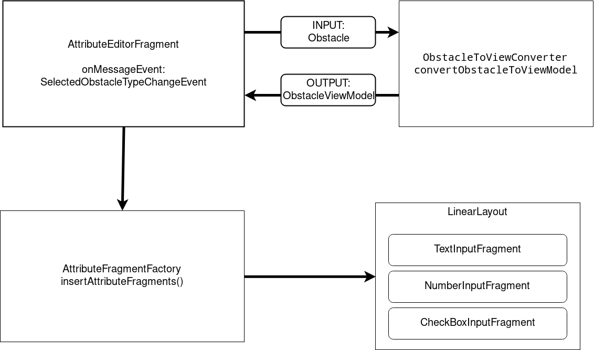

# Developer Guide

Das Projekt ist in drei GitHub Projekten aufgeteilt. 
- Android App
- Common Datenmodell 
- Web-API (Server)

Es wird ein Jenkins Server verwendet für die Continuous Integration der Web-API.


## Android App

Die Karte wird angezeigt mithilfe von Osmdroid. In der App wird "long press" und "single tap" als definierbare Interaktionen mit der Map verwendet. Hierfür ist das *Strategy Pattern* verwendet worden. Der aktive Operator ist in der Singleton Klasse *MapEditorState* gespeichert.

Es existieren aktuell zwei Operatoren:
- RoadEditorOperator (In Arbeit)
- PlaceNearestRoadsOnMapOperator (fertig)


Ein "floating action button" erscheint sobald eine Barriere auf der Karte gesetzt wurde (über PlaceNearestRoadsOnMapOperator). Über diesen wird ein stepper gestartet.

Der stepper entspricht den material design guidelines und wird von Stepstone entwickelt (Apache 2.0 Lic)

Der Stepper wird über *AddObstacleStepperAdapter* aufgebaut. Dort werden die einzelnen Fragmente geladen, welche das Interface *Step* bzw. *BlockingStep* implementieren. 


### Attribute Fragment Editor

Über einen Dynamischen Attribut Editor können Obstacles aus dem BP-Common Projekt editiert werden. Dieser lädt die benötigten Fragmente.
Hierfür wird die Java Reflection API verwendet, diese liest die gegebene Obstacle Klasse und erstellt für jedes Feld ein neues InputFragment. Über das InputFragment können die Werte erfasst werden.




Die erfassten Werte werden vor Abschluss der Datenerfassung noch einmal aufgelistet. Mit klicken auf "complete" werden die erfassten Daten an die routing.vincinator.de/api/barriers api gesendet (Method: POST). 

### EventBus


## Common Datenmodell

Das Common Datenmodell ist hier zu finden: [GitHub Projekt - vincinator/BP-Common](https://github.com/Vincinator/BP-common)

Über Annotationen werden die POJO für Hibernate und Jackson entsprechend konfiguriert. 

### Hibernate Konfiguration
Alle Objekte der gesammten Obstacle Vererbungshierarschie werden in einer einzigen Tabelle gespeichert. 
Hibernate kann sich aus der Tabelle die konkreten Klassen wieder zusammen bauen. 


### Jackson Konfiguration

Für die Kommuniktion zwischen Server und App werden JSON Daten verschickt. Diese sind so konfiguriert, dass die Konkrete Obstacle Klasse in ein JSON-Attribut als string gespeichert wird.

Beispiel:
```JSON
{
    "@class": "bp.common.model.obstacles.Stairs",
    "mName": null,
    "longitude": 49.874978,
    "latitude": 8.655971,
    "id": 1,
    "typeCode": "STAIRS",
    "numberOfStairs": 30,
    "handleAvailable": false,
    "heightOfStairs": 12,
    "name": "haben Treppen namen?"
  }
```

### Konfiguration für dynamsichen Attribut Editor

Über die *@EditableAttribute* Java Annotationen können Attribute der Obstacle POJO makriert werden, damit diese in der APP im Attribut Editor editierbar sind.

### Updating Dependency

Das BP-Common Projekt wird über Jitpack als Dependency für Server und App hinzugefügt. 
Über den [Jitpack - vincinator/BP-Common](https://jitpack.io/#Vincinator/BP-Common) Link kann die entsprechende Zeile für Gradle oder Maven herausgesucht werden. 
Der Server muss noch einmal gepusht werden mit den änderungen, damit diese auf routing.vincinator.de zu sehen sind.


## Web-API Server

Das Server Projekt ist hier zu finden [GitHub Project - Vincinator/BP17-Server](https://github.com/Vincinator/BP17-Server/)

Die web-API ist mithilfe von Jersey erstellt wordne. Swagger wird verwendet um eine interaktive API Dokumentation zur Verfügung zu stellen. 

Die Interaktive Dokumentation ist unter [routing.vincinator.de](www.routing.vincinator.de) erreichbar. 

Die Base URL der API ist unter routing.vincinator.de/api/barriers erreichbar. Der "/barriers" Endpunkt ist in der Java Klasse *BarriersService* implementiert. 

Weitere Endpunkte können analog zum *BarriersService* implementiert werden.


Commits in den Master Branch des Server Projektes 
 


