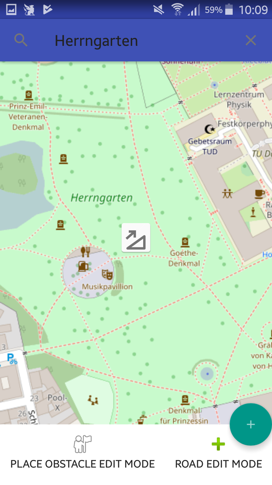

# BP-AndroidApp
Android App für das Bachelorpraktikum Datenerfassung für ein barrierefreies routing.

## Dependencies

- OKHttp
- osmdroid
- [BP Common Data Model](https://github.com/Vincinator/BP-Common)
- [stepstone-tech/android-material-stepper](https://github.com/stepstone-tech/android-material-stepper)
- EventBus [greenrobot eventBus Documentation](http://greenrobot.org/eventbus/documentation/)

## Developer Documentation
The Developer Guide is a working document, it will change over the time of the project. Please feel free to improve the document.

[Developer Guide](DeveloperGuide.md)

## Usage

### Step 1.
In order to place a new Obstacle on the openstreetmap roads, you need to retrieve road information.
long press near the place where you want to add the obstacle.

### Step 2.
The nearby roads are highlighted with an overlay.
You can click on the overlay to place the obstacle.

### Step 3.
The Action Button appears. Click the action Button if you are finished with the positioning.
Note: you can replace the position by clicking on an other spot at the highlighted road.
Note: you can also get other roads, by long pressing near the place where you want to get other roads.

### Step 4. 
After you have completed the Step-By-Step Dialog, your collected data has been send to the
server. The new Obstacle is now displayed.

